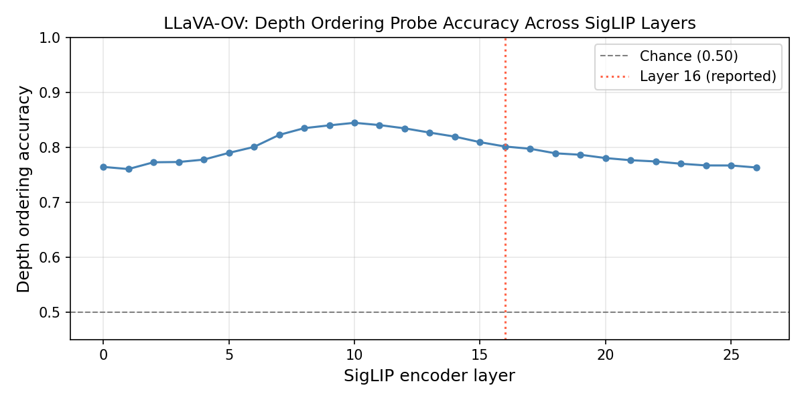

# Diagnosing Representation Bottlenecks in VLM Spatial Reasoning

**Bryan Lim — May 2026**

A diagnostic study of why LLaVA-OneVision-7B fails at 3D spatial reasoning on [MindCube](https://huggingface.co/datasets/MLL-Lab/MindCube). Five experiments rule out representation, information-access, and perceptual bottlenecks, localising the failure to **viewpoint simulation** — a compositional skill absent from standard VLM pretraining.

---

## Key Results

| Setting | N | Baseline | Depth Injection | Δ |
|---|---|---|---|---|
| Around | 250 | 65.2% | 64.4% | −0.8pp |
| Among | 600 | 41.8% | 42.7% | +0.9pp |
| Rotation | 200 | 34.5% | 35.0% | +0.5pp |
| **Overall** | **1050** | **46.0%** | **46.4%** | +0.4pp |

**Layer-sweep linear probe (depth ordering, chance = 50%):**

| SigLIP layer | Accuracy |
|---|---|
| Layer 0 (embeddings) | 76.4% |
| Layer 10 (peak) | **84.5%** |
| Layer 16 | 80.1% |
| Layer 26 (final) | 76.3% |

**Rotation-only interventions (baseline = 34.5%):**

| Condition | Accuracy | Δ |
|---|---|---|
| Oracle layout text injection | 33.5% | −1.0pp |
| NVS injection (Zero123++) | 34.5% | ±0.0pp |

The NVS null result is confirmed non-trivial: a diagnostic shows ~40% of individual answers change when the synthesized view is added, meaning the model attends to it but cannot exploit it.



---

## Conclusion

LLaVA-OneVision-7B's SigLIP encoder encodes depth geometry strongly at every layer (76–85%). Failing to improve with depth maps, explicit layout text, or even a synthesised post-rotation view rules out representation and information-access bottlenecks. The failure is specifically **viewpoint simulation**: the model lacks the learned mapping from input configuration to rotated spatial relations. Fixing this requires targeted training (e.g. expanded MindCube training data, video corpora with camera motion), not richer visual inputs.

See [`writeup.tex`](writeup.tex) for the full paper.

---

## Repository Structure

```
colab_baseline.ipynb          # Baseline evaluation (LLaVA-OV on all 1050 questions)
colab_depth_injection.ipynb   # Experiment 1: DepthAnything v2 maps as extra images
colab_layer_sweep.ipynb       # Experiment 2: Linear probe across all 27 SigLIP layers
colab_linear_probe.ipynb      # Single-layer probe (layer 16, initial experiment)
colab_oracle_layout.ipynb     # Experiment 3: Depth-zone text injected into prompt
colab_nvs_injection.ipynb     # Experiment 4: Zero123++ novel view synthesis injection

baseline_results.jsonl              # Per-sample baseline results (1050 samples)
depth_injection_results.jsonl       # Per-sample depth injection results
oracle_layout_results.jsonl         # Per-sample oracle layout results (200 rotation)
nvs_injection_results.jsonl         # Per-sample NVS injection results (200 rotation)
probe_results.json                  # Linear probe accuracies
layer_sweep.png                     # Depth probe accuracy vs. SigLIP layer (figure)
nvs_sanity.png                      # Sample reference vs. synthesised view pairs

src/
  dataset.py    # MindCubeDataset loader
  evaluate.py   # Answer extraction + metrics
  model.py      # LLaVA-OV wrapper (local/MPS)
run_baseline.py # CLI baseline runner

writeup.tex     # Full paper (LaTeX)
```

---

## Running the Experiments

All experiments run on Google Colab (A100 GPU). Data and models are loaded from Google Drive.

**Drive layout required:**
```
MyDrive/
  MindCube/
    data/
      raw/MindCube_tinybench.jsonl
      other_all_image/...
  models/
    llava-onevision-qwen2-7b-ov-hf/
    depth-anything-v2-small-hf/
```

**Run order:**
1. `colab_baseline.ipynb` — establishes the 46.0% baseline
2. `colab_depth_injection.ipynb` — depth maps as extra images (~45 min)
3. `colab_layer_sweep.ipynb` — all-layer probe (~40 min, separate A100 session)
4. `colab_oracle_layout.ipynb` — layout text injection, rotation only (~10 min)
5. `colab_nvs_injection.ipynb` — Zero123++ NVS injection, rotation only (~30 min)

Experiments 2–5 can be run in parallel across separate Colab tabs, each with its own A100 runtime.

---

## Models Used

- [LLaVA-OneVision-7B](https://huggingface.co/llava-hf/llava-onevision-qwen2-7b-ov-hf) — base VLM
- [DepthAnything v2 Small](https://huggingface.co/depth-anything/Depth-Anything-V2-Small-hf) — depth pseudo-labels and depth map injection
- [Zero123++](https://huggingface.co/sudo-ai/zero123plus-v1.1) — novel view synthesis for NVS injection

## Dataset

[MindCube](https://huggingface.co/datasets/MLL-Lab/MindCube) (MLL-Lab, 2024) — TinyBench split, 1050 questions.
